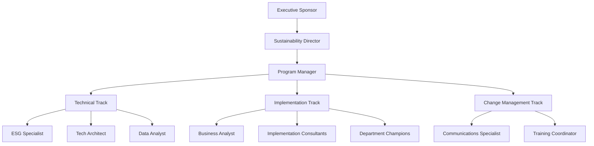

# Project Roles and Responsibilities

## Executive Level

### 1. Executive Sponsor
- Strategic oversight of the sustainability transformation
- Resource allocation and budget approval
- High-level stakeholder management
- Final decision-making authority
- KPI approval and monitoring

### 2. Sustainability Director
- Overall program leadership
- Strategy development and alignment
- Stakeholder engagement strategy
- Progress reporting to board and executives
- External partnership management

## Program Management

### 3. Program Manager
**Primary Responsibilities:**
- Day-to-day program coordination
- Resource management
- Timeline and milestone tracking
- Risk management
- Cross-functional team coordination
- Progress reporting and documentation

### 4. Change Management Lead
**Primary Responsibilities:**
- Stakeholder analysis and management
- Communication strategy development
- Training program design
- Resistance management
- Adoption monitoring and support

## Technical Roles

### 5. ESG Framework Specialist
**Primary Responsibilities:**
- ESG metrics development
- Assessment methodology design
- Data collection framework
- Compliance monitoring
- Performance analysis and reporting

### 6. Technology Architect
**Primary Responsibilities:**
- System integration design
- Data architecture development
- Technical requirements definition
- Platform selection and implementation
- Security and compliance oversight

### 7. Data Analyst
**Primary Responsibilities:**
- Data collection and validation
- Analytics and reporting
- KPI tracking and analysis
- Impact measurement
- Performance dashboards

## Implementation Team

### 8. Business Process Analyst
**Primary Responsibilities:**
- Process mapping and optimization
- Requirements gathering
- Gap analysis
- Solution design
- Implementation planning

### 9. Sustainability Implementation Consultants
**Primary Responsibilities:**
- Best practice guidance
- Industry benchmarking
- Implementation support
- Training delivery
- Quality assurance

### 10. Department Champions
**Primary Responsibilities:**
- Departmental implementation
- Local change management
- Team engagement
- Progress reporting
- Feedback collection

## Support Roles

### 11. Communications Specialist
**Primary Responsibilities:**
- Internal communications
- External stakeholder communications
- Progress updates
- Success story documentation
- Engagement material development

### 12. Training Coordinator
**Primary Responsibilities:**
- Training needs assessment
- Training material development
- Session coordination
- Progress tracking
- Feedback collection and analysis

## Subject Matter Experts

### 13. Environmental Specialist
**Primary Responsibilities:**
- Environmental impact assessment
- Climate strategy development
- Resource efficiency planning
- Environmental compliance
- Technical guidance

### 14. Social Impact Specialist
**Primary Responsibilities:**
- Community engagement
- Social impact assessment
- Stakeholder relationship management
- Social program development
- Impact measurement

### 15. Governance Expert
**Primary Responsibilities:**
- Governance framework development
- Policy and procedure design
- Compliance monitoring
- Risk assessment
- Board reporting

## Project Support

### 16. Project Coordinator
**Primary Responsibilities:**
- Administrative support
- Meeting coordination
- Documentation management
- Progress tracking
- Team communication support

## RACI Matrix

| Activity/Role | Executive Sponsor | Sustainability Director | Program Manager | Technical Leads | Implementation Team |
|--------------|-------------------|------------------------|-----------------|-----------------|-------------------|
| Strategy Development | A | R | C | C | I |
| Implementation Planning | I | A | R | C | C |
| Technical Design | I | A | C | R | C |
| Change Management | I | A | R | C | C |
| Progress Monitoring | A | R | R | C | C |
| Stakeholder Management | A | R | C | I | C |

Legend:
- R: Responsible
- A: Accountable
- C: Consulted
- I: Informed

## Team Structure

## Key Interfaces

### Internal
- Executive Leadership Team
- Department Heads
- IT Department
- HR Department
- Finance Department
- Operations Teams

### External
- Regulatory Bodies
- Industry Partners
- Technology Vendors
- Sustainability Consultants
- Community Stakeholders

## Success Metrics by Role

Each role will be evaluated based on specific KPIs aligned with the overall program objectives:

1. Executive Level
   - Strategic goal achievement
   - Budget management
   - Stakeholder satisfaction

2. Program Management
   - Timeline adherence
   - Risk mitigation effectiveness
   - Team performance

3. Technical Roles
   - System implementation success
   - Data quality and reliability
   - Technical objective achievement

4. Implementation Team
   - Implementation milestone achievement
   - Process improvement metrics
   - Adoption rates

5. Support Roles
   - Communication effectiveness
   - Training completion rates
   - Stakeholder feedback scores

## Resource Allocation

### Full-Time Roles
- Program Manager
- ESG Framework Specialist
- Technology Architect
- Business Process Analyst
- Project Coordinator

### Part-Time/Advisory Roles
- Executive Sponsor
- Subject Matter Experts
- Department Champions
- Communications Specialist

### External Resources
- Sustainability Implementation Consultants
- Technical Specialists
- Training Facilitators

## Next Steps

1. Role Assignment
   - Identify candidates for each role
   - Define detailed job descriptions
   - Establish reporting relationships

2. Team Onboarding
   - Initial team briefing
   - Role-specific training
   - Team building activities

3. Governance Setup
   - Establish steering committee
   - Define meeting cadence
   - Set up reporting structure

4. Resource Planning
   - Confirm resource availability
   - Define allocation percentages
   - Plan for surge capacity 